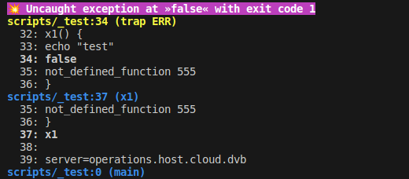
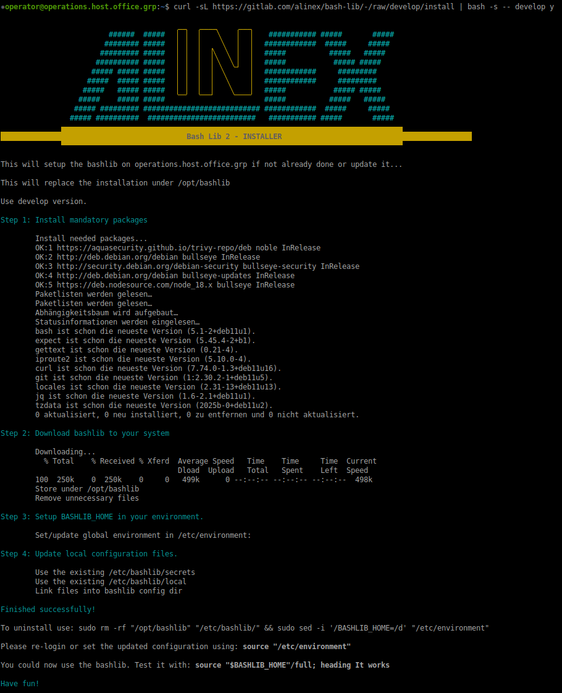

# BASH-LIB Generation 2

This is my personal library used to easily write powerful bash scripts which may work locally, partly remote or completely remote interactive or automatic.
It brings easy functions, makes your code more readable includes a wide range of tools and systems and helps finding problems in the scripts itself...

I use it privately and at work for:

- monitoring and server comparison
- changing servers like upgrades, enlarge disks, fix or install complex software
- updates which are partly manual
- security analysis using trivy
- and other common tasks

If you already use it jump directly to the [module description](https://gitlab.com/alinex/bash-lib/-/blob/master/doc/README.md).

## Table of Contents

- [BASH-LIB Generation 2](#bash-lib-generation-2)
  - [Table of Contents](#table-of-contents)
  - [Why use Bash](#why-use-bash)
    - [Personal history of bash](#personal-history-of-bash)
    - [Changes to Generation 1](#changes-to-generation-1)
    - [Look into the Future](#look-into-the-future)
  - [Distributions](#distributions)
  - [Architecture](#architecture)
    - [Quality](#quality)
    - [Error handling](#error-handling)
    - [Version control](#version-control)
  - [Installation](#installation)
    - [Switch Version](#switch-version)
  - [Usage](#usage)
    - [Full BashLib](#full-bashlib)
    - [BashLib Loader for Debug](#bashlib-loader-for-debug)
    - [Base Bashlib](#base-bashlib)
    - [Use in Terminal](#use-in-terminal)
    - [Remote BashLib](#remote-bashlib)
  - [Configuration](#configuration)
    - [Environment](#environment)
  - [Latest Changes](#latest-changes)
  - [Contributing](#contributing)

## Why use Bash

Bash is often dismissed as “just glue” or “only for quick scripts.” That reputation comes largely from old Bash habits, legacy `/bin/sh` assumptions, and poorly written shell code.
When used consciously, modern Bash (v4.2+) is a serious scripting language—but not a general-purpose one.

Bash is:

- A command language
- A process orchestration language
- A text-stream manipulation environment
- Bash can directly be interpreted, needs no virtual machine or translation

Bash is not:

- A high-level application language
- A numeric or data-science language
- A Unicode-first language

But as Bash speaks directly with processes, native pipes and redirection it can direct work to other tools in such parts it is not designed for. As an example you may use ffmpeg for video conversion and so on.

### Personal history of bash

First I learned it as only the glue to run a command. But for programming on the console I used perl. That was the golden time of Perl which later got more and more lost. I switched to NodeJS later with TypeScript but then came back to doing more in Bash. I found that I could also do everything in Bash and the command line utilities that I did with NodeJS.
After the first years I did often the same thing and had lots of copy and change in it, so I decided to make this BashLib. The library grew and grew but I got stuck with it. It was not modular and open enough and some parts were over engineered and got to complex over the time. I lost interest in the BashLib and made more and more again without it or only copying parts of it.
In 2025 I took some time and made a plan for a better base construct for the BashLib which I developed and changed multiple times completely till I got to the current BashLib 2 structure. The whole time I was not only developing it, but also used it actively myself. And now I am at the point there I can say I love to port all my scripts to the new BashLib and will do so over time. All new scripts are already based on it.

### Changes to Generation 1

Since the BashLib is publicly available since years some guys may also use it. And for those I can say Version 2 is a complete rework of the library meaning it is another toolset and you could not upgrade to it.
Some functionalities from the older version will no longer be available like logging while a lot of new possibilities are included.

What BashLib 2 brings:

- natural language to be easy to use
- powerful and modular methods
- expandable feature set
- remote capabilities integrated
- lots of api integrations
- multilingual (de, en at the moment)
- running in different unix operating systems (debian, ubuntu, alpine)
- unit tested and linted
- completely documented with examples

The downside may be:

- it is optimized for usability not speed
- some methods needs additional software which you have to install or will be installed
- needs bash v4.2 (February 2011)
- no backward compatibility to version 1 - everything is new

### Look into the Future

The BashLib itself is growing further each month through my own usage and needs and maybe some other developers will later take part, too.
We are not at the end, I have tons of ideas. There is so much potential that can be added in the future.

## Distributions

We test some distributions automatically using docker images.

The support is divided into: 
✅ fully supported
🟢 should also work (but not tested)
🟡 mostly supported
⏳ support comming soon
❔ no interest at the moment
⛔ could not be supported

| Distribution   | Versions  |         |            | Untested/Problematic          |
| -------------- | --------- | ------- | ---------- | ----------------------------- |
| Debian         | ✅ 11      | ✅ 12    | ✅ 13       |
| ⤷ Ubuntu       | ✅  22.04  | ✅ 24.04 |
| ⤷   Linux Mint | ✅ 21      | ✅ 22    |
| ⤷   KDE Neon   | ✅ stable  |
| ⤷ Kali Linux   | ✅ rolling |         |            | monitoring,remote             |
| ⤷ MX Linux     | 🟢 21      | 🟢 22    | 🟢 23       |
| ⤷ AntiX        | 🟢 23      |
| ⤷ Parrot OS    | 🟢         |
| Alpine         | ✅ 3.19    | ✅ 3.21  | ✅ 3.22     | mongo                         |
| Arch Linux     | ✅ rolling |         |            | remote                        |
| ⤷ Manjaro      | ✅ 25      |         |            | mongo,monitoring              |
| ⤷ EndeavourOS  | 🟢         |
| ⤷ Garuda Linux | 🟢         |
| ⤷ CachyOS      | 🟢         |
| RedHat         | 🟡 8       | ✅ 9     | ✅ 10       | mongo,monitoring,table,remote |
| ⤷ CentOS       | ⛔ 7       | 🟢 8     | 🟢 Stream 9 |
| ⤷ Fedora       | 🟢 41      | 🟢 42    | 🟢 43       |

## Architecture

It is a modular system with modules under: `core`, `config`, `module` and `extra`.
The file structure will look like:

```bash
bashlib/
    # load minified version or load all single files
    base            # only the base/core functionality (minified)
    full            # file with full functionality (minified)
    loader          # same as full but including all source files
    remote          # library with base configs for remote use
    # module directories
    core/           # core modules which always is needed (loaded by all of the above)
    config/         # individual configuration (loaded by all of the above)
    module/         # additional modules but included in full
    extra/          # special modules which always has to be loaded individually
    # internal data
    configs         # load all configurations (called from minified or loader)
    locale/         # translations
    # tools to manage and develop bashlib (for developer)
    install         # setup bashlib on your host
    # all other files are not relevant for use, only for development
    test            # helper to run test on docker instances
    tests/          # setup, installation and resources for this
    doc/            # examples and auto generated api documentation available through GitLab Web UI
    *               # some developer setup files ;-)
```

The BashLib will be installed on the System with it's `BASHLIB_HOME` directory in the environment to let the scripts find it and load what they need.

### Quality

The modules are as far as possible:

- optimized error handling
- unit tested using bats (over 200 core and 200 module tests)
- integration tested in different OS using docker
- CI tested on some OS
- and analyzed by the shellcheck static analysis and linting

Documentation of externally usable variables and functions is completely done inline and exported as [markdown documentation](./doc/README.md).

Management of bugs and issues will be done using [GitLab Issues](https://gitlab.com/alinex/bash-lib/-/issues) and we also use the milestones here. Self found bugs will be fixed mostly instant without any issue and commited to the repository.

### Error handling

If any error occur the BashLib will catch it using the `ERR trap` and will print an enhanced error message:



The message is level `CRITICAL`, the first line is `WARN`, further calls are `NOTICE` and the code view is `INFO` level.

### Version control

We use master and develop branch here. If you stay with the master branch you should always have a fully functional bash lib.
While we make changes to the develop branch we will merge this from time to time with the master, after ensuring everything is functional. This changes comes with a new version tag.
See all the changes in the [changelog](./CHANGELOG.md).

## Installation

This can be done manually after checking out the git repository by only setting the `BASHLIB_HOME` variable in your environment or directly. Or you use the installer which will setup everything for you (needs sudo rights):

```bash
# interactive install
curl -sL https://gitlab.com/alinex/bash-lib/-/raw/master/install | bash     
# automatic install, all values provided
curl -sL https://gitlab.com/alinex/bash-lib/-/raw/master/install | bash -s -- "<branch>" y|n

# update if already installed
curl -sL https://gitlab.com/alinex/bash-lib/-/raw/master/install | bash
```

This script will ask if you want to globally install it.

- globally installed in `/opt/bashlib` set in `/etc/environment` and config in `/etc/bashlib`
- locally installed in `<home-dir>/bashlib` set in `<home-dir>/.bashrc` and config in `<home-dir>/.bashlib-...`

Therefore the following steps will be done:

1. Install mandatory packages
2. Download bashlib to your system
3. Setup BASHLIB_HOME in your environment.
4. Update local configuration files.



The update will be the same, you only need to download the new files and overwrite the old ones.
If you want to remove it later the commands will be shown while installing/updating, too.

### Switch Version

By default the latest version from master branch will be used, also if you run the installer from another tag or branch.

If you want to have another version use the specific branch name as argument or in as you are asked:

- `master` - mostly stable and tested version but without the newest changes
- `develop` - newest changes, but maybe not thoroughly tested
- tags like `v2.3.0` - older version

And you can also at any time download the BasLib yourself and set `$BASHLIB_HOME` to this directory to work with it, like I do with my developer directory.
Or use it without local installation, see below.

## Usage

This will show you how to use it after installation or without installation. See the possibilities explained below.

For further assistance see the [Examples](./doc/README.md#Examples) within the Modules API documentation.
A [bash short reference](./bash-reference.md) is also available here.

### Full BashLib

This is a compressed library containing all core and modules. ANd will load the configurations from the config folder, too.

Your scripts will start with:

```bash
#!/usr/bin/env bash
source $BASHLIB_HOME/full           # to have all tools ready
```

### BashLib Loader for Debug

This will load all files individually, making error references to the source files, not the line in the compressed full script. This is preferable for debugging.
Mostly it is used if DEBUG is set instead of the full lib:

```bash
#!/usr/bin/env bash
test -z "${DEBUG-}" && source "$BASHLIB_HOME"/full || source "$BASHLIB_HOME"/loader
```

### Base Bashlib

If you need only some specific parts of the BashLib, it is advisable to use the base which only contains the core functionality.

And for the scripts better use the individual loading if not so much is needed:

```bash
#!/usr/bin/env bash
source $BASHLIB_HOME/base           # to load only basics
source $BASHLIB_HOME/module/output  # and then single modules
source $BASHLIB_HOME/configs        # load configuration
# or load modules as needed with
use module/output
```

### Use in Terminal

You can also use the BashLib directly in the terminal.
Load it directly in bash with one of the above `source` commands.

### Remote BashLib

And at last if you run a script seldom and want not to install the BashLib on your host, you may use it directly from the net, this is the full bashlib with default environment configuration bundled together.
But to fully work it will store a footprint of about 25kB within your temp folder (`/tmp/bashlib`) like i18n files.

```bash
#!/usr/bin/env bash
source <(curl -s https://gitlab.com/alinex/bash-lib/-/raw/master/remote)
```

Now you have to include your specific configuration like API and secrets directly in the code to fully use it.

If an error occurs while using the remote BashLib you may encounter an additional error which you should ignore:

```text
awk: fatal: cannot open file `/dev/fd/63' for reading: No such file or directory
```

## Configuration

The configuration is under `config/` folder and will be loaded in alphabetically order. For your configuration change only the `local` and `secrets` which are linked to your local configuration folder.

The configuration is the same for the whole host. To make program specific configuration overwrite it in your program after loading the bashlib. And you may also run the same program with different configuration by defining an additional configuration file to load using environment, see below.

### Environment

There is a build in `DEBUG=1` flag, which you can set to do some specific debugging steps within the code. This is aimed to be used for development and bug fixing.

```bash
DEBUG=9 my-script
```

Ideally you will also switch to use the loader from within your script if `DEBUG` is set:

```bash
test -z "${DEBUG-}" && source "$BASHLIB_HOME"/full || source "$BASHLIB_HOME"/loader
```

You may also set an additional configuration file using `CONFIG` which can overwrite the host specific setting:

```bash
CONFIG=/home/user/special-setup my-script
```

But you cannot overwrite the configuration settings by environment.

## Latest Changes

This will be shown in our [changelog](./CHANGELOG.md).

## Contributing

👋 Welcome, and thank you for your interest in contributing to **BashLib 2**!  
We’re happy you’re here — whether you’re adding new ideas, make a translation, fixing bugs, improving scripts, or adding new utilities.

Please have a look at the [contributing page](./CONTRIBUTING.md).
