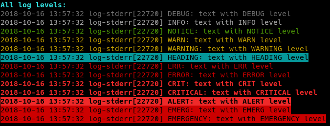
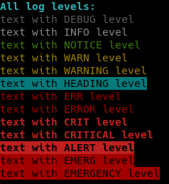

# Log Handler

A handler to write logs with an easy to use logging library that can be sourced from scripts.
It allows logging to an arbitrary file, to `STDERR`, or to a syslog facility. It supports eight logging levels.



The log handler can be used as program or library.



With the simplified output for `STDOUT` it can also be used as colorization toolkit.

## Usage

### Setup

For usage as command or library the configuration is the same and fully optional:

```bash
# basic output selection
LOG_CONSOLE='STDERR'                # output to STDERR (default)
LOG_CONSOLE='STDOUT'                # output to STDOUT without date, tag, pid and type
# alternatively or additionally use one of the following
LOG_FILE='/var/log/myscript.log'    # output in file
SYSLOG_FACILITY='local7'            # output to syslog
# specify logging
LOG_LEVEL='INFO'                    # minimum log level
LOG_DATE_FORMAT="+%Y-%m-%d %H:%M:%S"
# file rotation
LOG_ROTATE_TIME=[DAILY|WEEKLY|MONTHLY]
LOG_ROTATE_SIZE=<bytes>
LOG_ROTATE_NUM=<max number of files>
LOG_ROTATE_COMPRESS=1
```

### Command

To use it within the shell you can use the binary under `bin/log`. For easier use you may also
add it to the path like used in the following example:

```bash
log <type> <message>      # log to file
cat xxx | log             # pipe to log
cat xxx | log <type>      # pipe with specific log type
```

### Library

If you use it within another bash file you can also include the library and use it directly,
which will also include the colors library:

```bash
source ../bash-lib/log.bash  # log handler
```

After that messages may be invoked easily using:

```bash
log INFO "process is working"
log_exit EMERG "preprocessing not done, stopping" 16
```

While the first call will only output the log message, the second call also exits the running program with the additionally given exit code.

To log the call of some other routines use:

```bash
log_cmd date +%Y-%m-%d
```

This will use the auto detection logger and give you the result of the command in variable `$result`.

## Piping messages

But you can also pipe output from other commands directly to the log:

```bash
run-process | log INFO # log stdin
run-process 2>&1 >/dev/null | log ERROR # log stderr
run-process |& log INFO # log stdin + stderr
( run-process | log INFO ) 3>&1 1>&2 2>&3 | log ERROR # log both differently
( run-process 3>&1 1>&2 2>&3 | log ERROR ) 3>&1 1>&2 2>&3 | log INFO # priorize INFO
result=$(run-process |& tee >(log AUTO) | cat) # log output and store it in variable
```

The lines four and five shows how to flip `STDOUT` and `STDERR` as pipe works on file descriptor one only.

## Auto detect Level

Often useful in pipes but also usable in other log messages is the special `AUTO` log setting:

```bash
run-process |& log AUTO
( run-process 3>&1 1>&2 2>&3 | log ERROR ) 3>&1 1>&2 2>&3 | log AUTO # STDERR always as ERROR
```

This will auto detect the concrete log level for each line. Currently `DEBUG`, `INFO`, `NOTICE`, `WARN`, `WARNING`, `ERR`, `ERROR`, `CRIT`, `CRITICAL`, `ALERT`, `EMERG` and `EMERGENCY` will trigger the specified log type. Some other keywords are also interpreted and all other lines are output as `DEBUG` type.

## Log Levels

Eight logging levels are supported, combining the levels from the Python logging module and RFC 5424.

| Level              | Numeric value | Syslog numerical code | Origin              |
| ------------------ | ------------- | --------------------- | ------------------- |
| DEBUG              | 10            | 7                     | Python and RFC 5424 |
| INFO               | 20            | 6                     | Python and RFC 5424 |
| NOTICE             | 25            | 5                     | RFC 5424 specific   |
| WARN or WARNING    | 30            | 4                     | Python and RFC 5424 |
| HEADING            | 35            | 4                     | own extension       |
| ERR or ERROR       | 40            | 3                     | Python and RFC 5424 |
| CRIT or CRITICAL   | 50            | 2                     | Python and RFC 5424 |
| ALERT              | 60            | 1                     | RFC 5424 specific   |
| EMERG or EMERGENCY | 70            | 0                     | RFC 5424 specific   |

Setting the `LOG_LEVEL` in the script will log subsequent log messages at that value or higher only.
The `LOG_LEVEL` may be changed anytime within the script.

## File rotation

While the library keeps the log file opened for better performance you can't rotate it using external tools. But the integrated rotation will do perfectly fine.

### Rotate by date

```bash
LOG_ROTATE_TIME=DAILY   # date as YYYY-MM-DD
LOG_ROTATE_TIME=WEEKLY  # date as YYYY_week_WW
LOG_ROTATE_TIME=MONTHLY # date as YYYY-MM
```

If this is set the current logs will go in the normal log file but on a new day the old file will be renamed with it's date pattern appended.

The rotated files may also be compressed by setting the `LOG_ROTATE_COMPRESS` flag.

### Rotate by size

To rotate on fixed file size use:

```bash
LOG_ROTATE_SIZE=<bytes>
LOG_ROTATE_NUM=<max number of files>
```

The rotated files may also be compressed by setting the `LOG_ROTATE_COMPRESS` flag.

> But you can't combine the two rotation methods by date and by size, currently.
