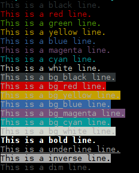

# Color Output

Setup color methods to be used in bash scripts for formatting. It contains methods to output ANSI color codes.

The possible colors and styles supported are:



The terminal will automatically interpret this but depending on the color scheme of your terminal the colors may differ.

To also see the color codes in other programs use:

-   `alias less='less -R'` enables ANSI color support

## Include

First you have to load the library or any package, because all contain them:

```bash
source src/bash-lib/colors.bash  # load color methods
source dist/core.bash            # or load the core package
```

See the [general usage](../) on how to include.

## Add color or style

To set the different colors and styles you have different methods, which all work the same way:

**Format text** if a text is given as arguments, use style only for this

```bash
red "Direct ouput without newline"
echo "$(red 'output with newline') but not this"
echo "$(red multiple parameters are joined by spaces)"
x=$(red "load colorized into variable")
x="manually switch $(red +)on$(reset) and off"
```

Above you see the different possibilities to use. While line 1 to 3 will write to `STDOUT` the last two lines will store the colored output in a variable.

**Text given as pipe** instead of parameters

Like done in bash with other methods, you can also pipe the stream to colorize it:

```bash
echo "This text is colored using pipe" | cyan
```

But then no parameter is allowed to the color or style method.

**Separately start and end style** if called with `+` or without arguments and pipe

```bash
red +
echo -n "Text in red"
bold +
echo -n " and bold"
reset
echo " and normal again.
```

As shown above you start using the `+` sign and end all styles with `reset`. The `-n` switch to echo is used to prevent newline on the first two calls and get all into one line.

## Defined colors and styles

### Foreground color

The following methods will set the foreground colors:

-   `black`
-   `red`
-   `green`
-   `yellow`
-   `blue`
-   `magenta`
-   `cyan`
-   `white`

### Background color

The following methods will set the background colors:

-   `bg_black`
-   `bg_red`
-   `bg_green`
-   `bg_yellow`
-   `bg_blue`
-   `bg_magenta`
-   `bg_cyan`
-   `bg_white`

### Styles

The following methods will set other styles:

-   `bold`
-   `underline`
-   `inverse`
-   `dim`

## Remove colors and styles

And if you want to remove the coloring later again use the `decolor` method:

```bash
ctext=$(bg_red "This text with red background")
echo "original: $ctext"
echo "decolor using parameters: $(decolor $ctext)"
echo "decolor using pipe: $ctext" | decolor
```

## Convert to HTML

This is easily done using [aha](https://github.com/theZiz/aha), a small converter which may be installed as linux package from the default repository.

```bash
command 2>&1 | aha -b | mail -s "Command Report" -a "Content-Type: text/html" myself@email.de
```
