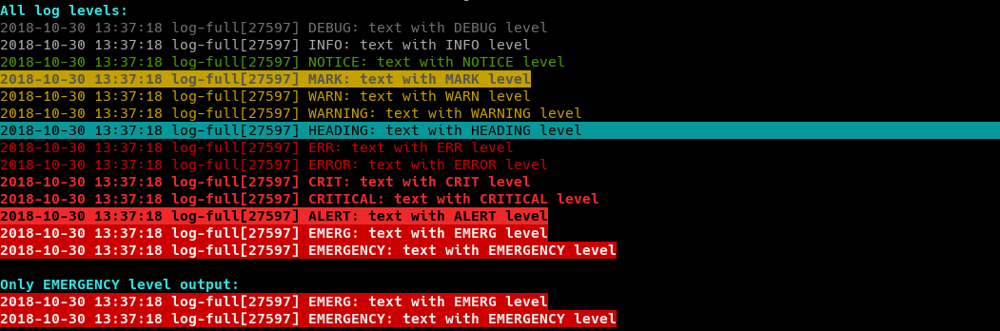
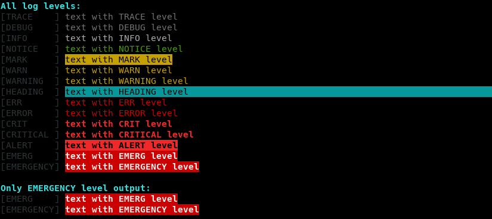

# Log Handler

A handler to write logs with an easy to use logging library that can be sourced from scripts.
It allows logging to an arbitrary file, to `STDERR`, or to a syslog facility. It supports eight logging levels.



The log handler can be used as program or library.



With the `SIMPLE` console output for `STDERR` it can also be used as colorization toolkit. `STDOUT` is not supported here because it may become problematic with functions doing both, sending results through `STDOUT` and logging to `STDOUT`.

## Usage

### Setup

For usage as command or library the configuration is the same and fully optional:

```bash
# basic output selection
LOG_CONSOLE='SIMPLE'                # output to STDERR (default)
LOG_CONSOLE='FULL'                  # output to STDERR without date, tag, pid and type
# alternatively or additionally use one of the following
LOG_FILE='/var/log/myscript.log'    # output in file
SYSLOG_FACILITY='local7'            # output to syslog
# specify logging
LOG_LEVEL='INFO'                    # minimum log level
LOG_LEVEL_DEFAULT='AUTO_INFO'       # default log level to use if none
LOG_DATE_FORMAT="+%Y-%m-%d %H:%M:%S"
LOG_TAG="test"                      # defaults to current process name
# file rotation
LOG_ROTATE_TIME=[DAILY|WEEKLY|MONTHLY]
LOG_ROTATE_SIZE=<bytes>
LOG_ROTATE_NUM=<max number of files>
LOG_ROTATE_COMPRESS=1
# user defined auto detection and coloring (regexp)
LOG_AUTO[OK]="\b(done|transferred)\b"
LOG_AUTO[MARK]="!!!"
# command log calls
LOG_CMD_QUIET=1                     # will prevent call and success messages
LOG_CMD_LEVEL=AUTO_INFO             # the log level used for command output
```

### Command

To use it within the shell you can use the binary under `bin/log`. For easier use you may also
add it to the path like used in the following example:

```bash
log <type> <message>      # log to file
cat xxx | log             # pipe to log
cat xxx | log <type>      # pipe with specific log type
log INFO <../list.txt     # output file contents
```

### Library

If you use it within another bash file you can also include the library and use it directly,
which will also include the colors library:

```bash
source ../bash-lib/log.bash  # log handler
```

After that messages may be invoked easily using:

```bash
log INFO "process is working"
log_exit EMERG "preprocessing not done, stopping" 16
```

While the first call will only output the log message, the second call also exits the running program with the additionally given exit code.

To log the call of some other routines use:

```bash
log_cmd date +%Y-%m-%d
```

This will use the auto detection logger and give you the result of the command in variable `$result` while also piping the output together with errors to the log module.

## Piping messages

But you can also pipe output from other commands directly to the log:

```bash
run-process | log INFO # log stdin
run-process 2>&1 >/dev/null | log ERROR # log stderr
run-process |& log INFO # log stdin + stderr
result=$(run-process |& tee >(log) | cat) # log output and store it in variable
```

The following lines show how to use different settings for `STDOUT` and `STDERR`.

```bash
( run-process | log INFO ) 3>&1 1>&2 2>&3 | log ERROR # log both differently
( run-process 3>&1 1>&2 2>&3 | log ERROR ) 3>&1 1>&2 2>&3 | log INFO # priorize INFO
```

> But keep in mind that this may lead to double logging if `LOG_CONSOLE` is used.

You can also use `tee` to duplicate output streams.

## Auto detect Level

Often useful in pipes but also usable in other log messages is the special `AUTO` log setting:

```bash
run-process |& log
run-process |& log AUTO
```

This will auto detect the concrete log level for each line. Currently `TRACE`, `DEBUG`, `INFO`, `NOTICE`, `MARK`, `WARN`, `WARNING`, `HEADING`, `ERR`, `ERROR`, `CRIT`, `CRITICAL`, `ALERT`, `EMERG` and `EMERGENCY` will trigger the specified log type. Some other keywords are also interpreted and all other lines are output using the minimum level.

You can also specify a higher or lower minimum level as `DEBUG` by using:

```bash
run-process |& log AUTO_INFO
run-process |& log AUTO_WARN
run-process |& log AUTO_TRACE
```

If this is set the minimum level be the given one but it will be increased by auto detection.

To add more rules for the auto detection you may add a regular expression per each log level:

```bash
declare -A LOG_AUTO # only needed if defined before loading the liubrary
LOG_AUTO[OK]="\b(done|transferred)\b"
LOG_AUTO[MARK]="!!!"
```

It is always case insensitive and will be used additionaly to the default detection.

## Log Levels

Eight logging levels are supported, combining the levels from the Python logging module and RFC 5424.

| Level              | Numeric | Syslog | Origin        | Usage                                     |
| ------------------ | ------- | ------ | ------------- | ----------------------------------------- |
| TRACE or VERBOSE   | 5       | 7      | Log Utilities | Very detailed logging (not always used)   |
| DEBUG              | 10      | 7      | RFC 5424      | Diagnostically helpful messages           |
| INFO               | 20      | 6      | RFC 5424      | Something which may be useful to know     |
| NOTICE             | 25      | 5      | RFC 5424      | Success message or step done              |
| MARK               | 25      | 5      | own extension | Special marked like information asked for |
| WARN or WARNING    | 30      | 4      | RFC 5424      | Warning which may be OK                   |
| HEADING            | 35      | 4      | own extension | Start of new bigger Part                  |
| ERR or ERROR       | 40      | 3      | RFC 5424      | An error which can occur                  |
| CRIT or CRITICAL   | 50      | 2      | RFC 5424      | An error which should not occur           |
| ALERT              | 60      | 1      | RFC 5424      | Very critical like incorrect method call  |
| EMERG or EMERGENCY | 70      | 0      | RFC 5424      | Something which should never happen       |

Setting the `LOG_LEVEL` in the script will log subsequent log messages at that value or higher only.
The `LOG_LEVEL` may be changed anytime within the script.

> While the most log levels are from the error levels, we also added `MARK` and `HEADING` as report levels which don't have an real error case. This allows to also use the log library to send informational higher prioritized output.

## File rotation

While the library keeps the log file opened for better performance you can't rotate it using external tools. But the integrated rotation will do perfectly fine.

> But you are also free to do this on your own.

### Rotate by date

```bash
LOG_ROTATE_TIME=DAILY   # date as YYYY-MM-DD
LOG_ROTATE_TIME=WEEKLY  # date as YYYY_week_WW
LOG_ROTATE_TIME=MONTHLY # date as YYYY-MM
```

If this is set the current logs will go in the normal log file but on a new day the old file will be renamed with it's date pattern appended.

The rotated files may also be compressed by setting the `LOG_ROTATE_COMPRESS` flag.

### Rotate by size

To rotate on fixed file size use:

```bash
LOG_ROTATE_SIZE=<bytes>
LOG_ROTATE_NUM=<max number of files>
```

The rotated files may also be compressed by setting the `LOG_ROTATE_COMPRESS` flag.

> But you can't combine the two rotation methods by date and by size, currently.

## Switching log file

If really necessary, it is possible to switch log file by changing the setting of `LOG_FILE` and calling `log_init` without parameters.
